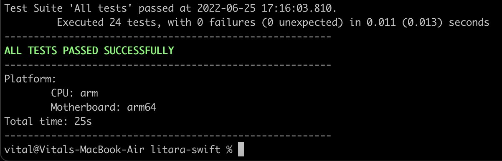
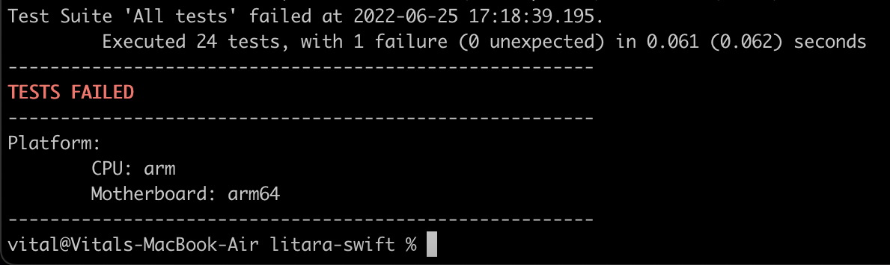

By default `swift test` does not highlight result in Terminal output. And it is not an easy thing to understand if tests have not passed successfully.

Instead of `echo $?` run a script highlighting result. For example, add this bin folder on your path and run it from everywhere in the system like:
```shell
sweet-test
```
It runs on Mac OS, Mac Docker, native Linux.

There are examples on screenshots below.

Success:  


Failure:  

